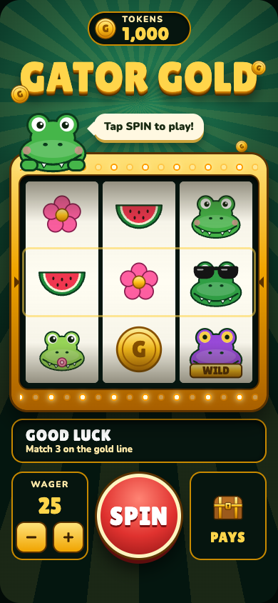
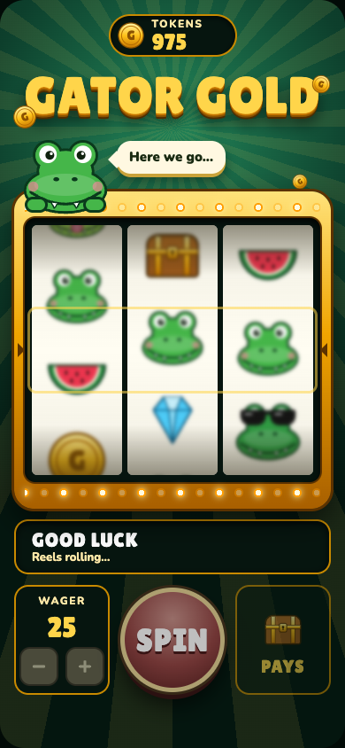
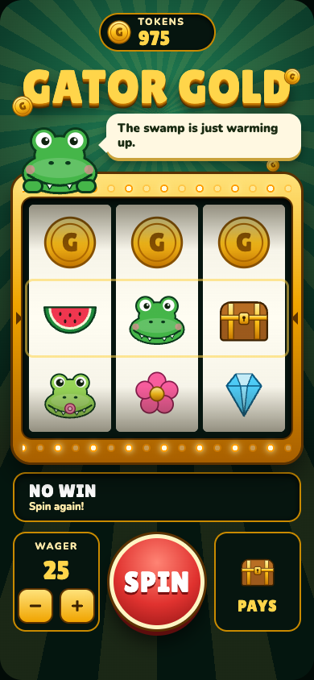
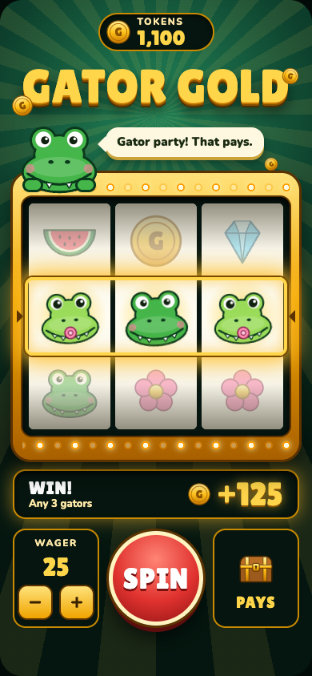
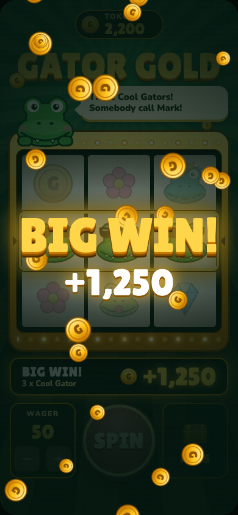
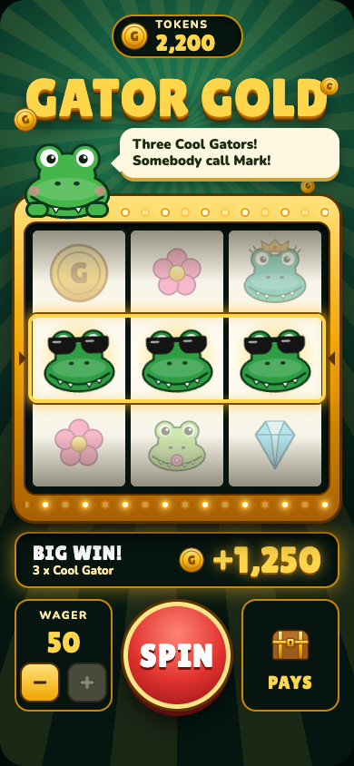
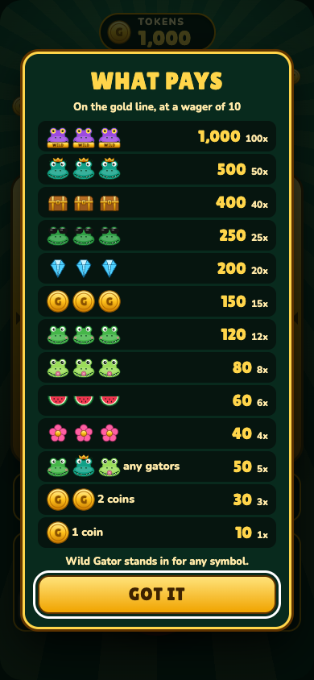
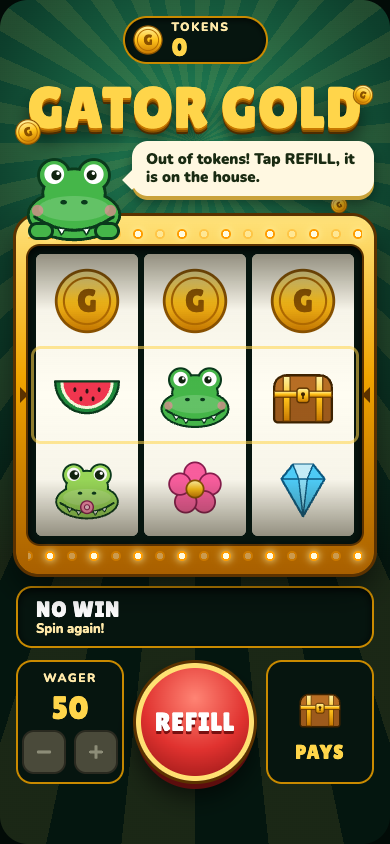

# Feature 2: The machine, evidence

> **Partly superseded.** [Feature 3](../03-more-ways/evidence.md) added four more win lines and changed the payouts, so the amounts and screenshots below show the game as it was after feature 2.

Captured on 2026-10-06 against [intent.md](intent.md) by playing the running game in headless Chrome at phone size (390 x 844). Reproduce with `npm start` in one terminal and `npm run evidence` in another; raw values are in [evidence/results.json](evidence/results.json).

## Result against each criterion

| # | Criterion | Result | Evidence |
| --- | --- | --- | --- |
| 1 | Opens with one command, no instructions needed | Pass for opening; "no instructions" is unknown | `npm start`, then http://localhost:4747. Nobody but the test script has played it yet |
| 2 | SPIN takes the wager, rolls, and stops on a slot-math result | Pass | Every forced spin landed on the line the slot math gives for those reel positions |
| 3 | Reels stop in order; last reel hangs on a possible three of a kind | Pass | Normal stops at about 1.1 s, 1.6 s, 2.1 s; with two matching symbols the last reel stops at about 3.65 s |
| 4 | Each kind of win shows with the right symbols lit and the right amount | Pass | See the spins table |
| 5 | A loss is plainly a loss and the player can spin again | Pass | "NO WIN", nothing lit, SPIN enabled |
| 6 | A big win gets a bigger celebration | Pass | Full-screen "BIG WIN!" with a coin shower; a normal win only lights the line |
| 7 | Balance is right after every spin | Pass | 60 random spins across all three wagers, 0 mismatches, plus 10 automated accounting checks |
| 8 | Wager changes between spins and never exceeds the balance | Pass | Steps 10, 25, 50 and stops at each end; controls lock during a spin |
| 9 | Running out of tokens does not dead-end | Pass | At 0 tokens SPIN becomes REFILL and restores 1,000 |
| 10 | Looks like the approved mockup | Pass by my comparison; Mark's call | Screenshots below |

No errors were logged by the page during the run. All 25 automated checks pass (`npm test`).

## Forced spins

Each started from 1,000 tokens. Add `?stops=` and the numbers to the game's address to see one yourself.

| Case | Stops | Win line | Wager | Win | Balance after | Shown as |
| --- | --- | --- | --- | --- | --- | --- |
| Loss | 0,1,1 | Watermelon, Happy Gator, chest | 25 | 0 | 975 | NO WIN |
| One coin | 0,0,1 | Watermelon, coin, chest | 25 | 25 | 1,000 | WIN!, coin lit |
| Any three gators | 1,1,3 | Baby, Happy, Baby | 25 | 125 | 1,100 | WIN!, three lit |
| Three Baby Gators | 1,4,3 | Baby, Baby, Baby | 25 | 200 | 1,175 | WIN!, three lit |
| Big win | 5,3,14 | Cool, Cool, Cool | 50 | 1,250 | 2,200 | BIG WIN! |
| Near miss | 16,20,1 | Queen, Queen, chest | 25 | 0 | 975 | NO WIN after a long last reel |

## Screenshots

| | |
| --- | --- |
| At rest  | Mid-spin  |
| Loss  | Any three gators  |
| Big win celebration  | Big win settled  |
| Payout table  | Out of tokens  |

## Not covered

- No person has played it. Feel, pacing, and whether it needs instructions are untested.
- Tested in Chrome only, at phone size plus one laptop-size screenshot. Not tested on a real phone or in Safari.
- The celebration and reel motion were checked by screenshot and timing, not watched as video.

## Decisions made while building

- The PAYS button sits where the mockup had Cash Out. Cash Out is feature 6; a button that did nothing would be confusing.
- The mockup's sound button is left out until sound exists.
- The balance resets to 1,000 on reload. Saving it is not in this feature.
- Refill gives 1,000 free tokens at zero. This was a proposed default, not something Mark chose.
