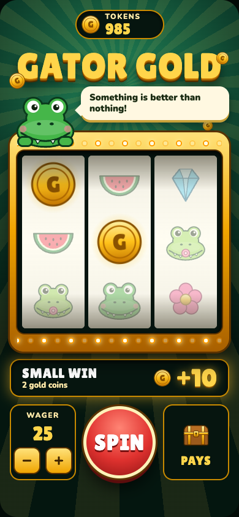
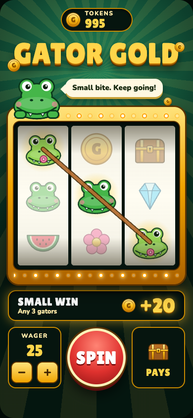
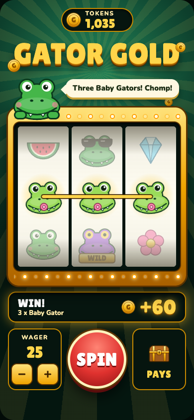
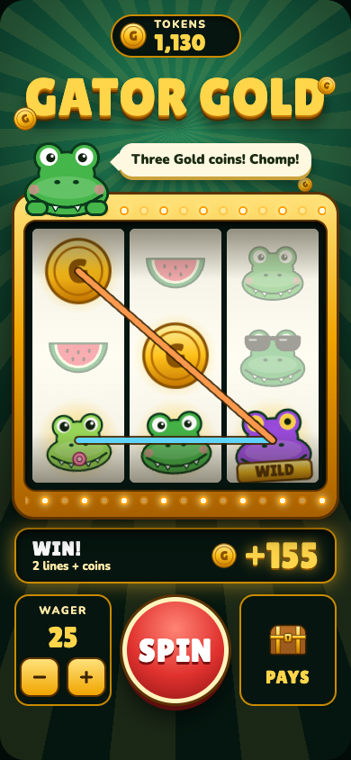
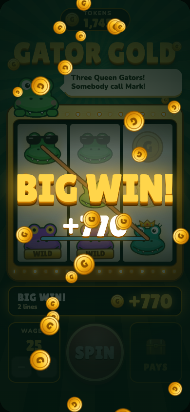
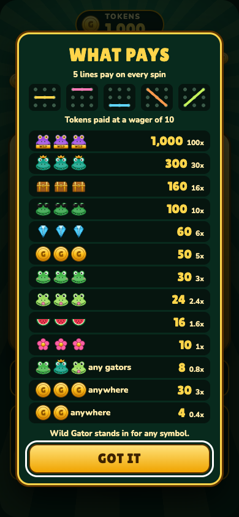

# Feature 3: More ways to win, evidence

Captured on 2026-10-06 against [intent.md](intent.md). Reproduce the figures with `npm run report`, the checks with `npm test`, and the screenshots with `npm start` plus `npm run evidence`. Raw browser values are in [evidence/results.json](evidence/results.json).

## What changed for the player

| | After feature 2 | Now |
| --- | --- | --- |
| Ways to win | 1 line | 5 lines, plus coins anywhere |
| Spins that pay something | 34% | 56% |
| Spins that pay the wager back or more | 34% | 21% |
| Spins that pay less than the wager | none | 35% |
| Return to player | 96.4% | 95.1% |
| Top prize | 100x the wager | 100x on one line, 102.4x at most |

The player now sees something light up on more than half of all spins. Most of those are small: a third of all spins pay back less than was wagered.

## Result against each criterion

| # | Criterion | Result | Evidence |
| --- | --- | --- | --- |
| 1 | Five lines win | Pass | Each line checked on its own |
| 2 | Three of a kind is the big prize, rarer pays more | Pass | 56% of all tokens returned come from three of a kind |
| 3 | Any three gators pays less than the wager | Pass | Pays 0.8x |
| 4 | Coins pay anywhere | Pass | 2 coins 0.4x, 3 coins 3x |
| 5 | 45% to 60% of spins pay something | Pass | 55.61%, exact |
| 6 | 15% to 25% pay the wager back or more | Pass | 21.05%, exact |
| 7 | Big win once in 40 to 120 spins | Pass | Once in 67, exact |
| 8 | Return between 93% and 97% | Pass | 95.07%, exact |
| 9 | A long session usually ends below its start | Pass | After 300 spins the median balance is 788, 20, and 30 at wagers 10, 25, and 50 |
| 10 | 1,000 usually lasts 100 spins at the lower wagers | Pass | Ran out in 0.0% and 7.8% of sessions at 10 and 25 |
| 11 | Wins show their symbols and line; small wins are not oversold | Pass | See forced spins; a small win is titled SMALL WIN with no celebration |
| 12 | Balance right after every spin | Pass | 60 random browser spins, 0 mismatches; 10 accounting checks |

All 30 automated checks pass. The page logged no errors.

## Forced spins in the browser

Each started from 1,000 tokens at a wager of 25.

| Case | Stops | What won | Win | Balance after | Shown as |
| --- | --- | --- | --- | --- | --- |
| Loss | 0,2,3 | Nothing | 0 | 975 | NO WIN |
| Two coins | 0,0,3 | 2 coins in view | 10 | 985 | SMALL WIN, 2 symbols lit |
| Gators, middle line | 1,1,3 | Any 3 gators | 20 | 995 | SMALL WIN, 1 line |
| Gators, diagonal | 2,1,2 | Any 3 gators | 20 | 995 | SMALL WIN, 1 line |
| Three Baby Gators | 1,4,3 | 3 of a kind | 60 | 1,035 | WIN!, 1 line |
| Several at once | 0,0,24 | 2 lines and coins | 155 | 1,130 | WIN!, 2 lines, 5 symbols lit |
| Big win | 6,4,7 | 3 Queen Gators and a gator line | 770 | 1,745 | BIG WIN! with celebration |
| Near miss | 16,20,0 | Nothing | 0 | 975 | NO WIN after a long last reel |

## Screenshots

| | |
| --- | --- |
| Small win, coins  | Small win, diagonal  |
| Win  | Several lines  |
| Big win  | Payout view  |

## How the house wins

Nothing is rigged. Each spin is an independent draw from the reels and the game never looks at the balance. The house comes out ahead because the payouts return 95.07 tokens for every 100 wagered, and because a third of spins hand back less than they cost while still lighting up as a win.

That is enough to drain a session. At a wager of 25, half of all 300-spin sessions end with nothing.

## Not covered

- Nobody has played this version. Whether it feels less boring is Mark's call.
- Whether small wins this frequent feel rewarding or cheap is untested. If cheap, raise the any-three-gators prize or make it rarer.
- Chrome only.

## Decisions made while building

- A pair of matching symbols was tried as a prize and dropped: it made 79% of spins pay, which cheapens a win.
- The big-win line moved from 15x to 10x the wager, because prizes are now spread over five lines.
- The last reel now hangs only when a big three of a kind is one symbol away, about one spin in eight. Hanging on every pair would have slowed half of all spins.

## Exact figures

From all 39,304 reel positions, with 5 lines in play.

| Measure | Value |
| --- | --- |
| Return to player | 95.07% |
| Spins that pay anything | 55.61% (one in 1.8) |
| Spins that pay the wager back or more | 21.05% (one in 4.8) |
| Big wins (10x the wager or more) | 1.49% (one in 67) |

## Payout table

Prizes as a multiple of the wager.

| Prize | Pays | Symbols per reel |
| --- | --- | --- |
| 3 x Wild Gator on a line | 100x | 1, 1, 1 |
| 3 x Queen Gator on a line | 30x | 2, 2, 2 |
| 3 x Treasure chest on a line | 16x | 2, 2, 2 |
| 3 x Cool Gator on a line | 10x | 3, 3, 3 |
| 3 x Diamond on a line | 6x | 3, 3, 3 |
| 3 x Gold coin on a line | 5x | 3, 3, 3 |
| 3 x Happy Gator on a line | 3x | 4, 4, 4 |
| 3 x Baby Gator on a line | 2.4x | 5, 5, 5 |
| 3 x Watermelon on a line | 1.6x | 5, 5, 5 |
| 3 x Swamp flower on a line | 1x | 6, 6, 6 |
| Any 3 gators on a line | 0.8x | |
| 3 gold coins anywhere | 3x | |
| 2 gold coins anywhere | 0.4x | |

## Where the wins come from

| Kind of prize | Prizes per 100 spins | Share of all tokens returned |
| --- | --- | --- |
| Any 3 gators on a line | 37.5 | 31.5% |
| Gold coins anywhere | 17.3 | 12.4% |
| Three of a kind on a line | 14.5 | 56.1% |

## How big each spin pays

| Spin pays | Share of spins | About one in |
| --- | --- | --- |
| Nothing | 44.39% | 2.3 |
| Less than the wager | 34.56% | 2.9 |
| 1x to under 3x | 14.09% | 7.1 |
| 3x to under 10x | 5.48% | 18.3 |
| 10x to under 30x | 1.14% | 87.3 |
| 30x or more | 0.34% | 291.1 |

The largest possible spin pays 102.4x the wager.

## Simulated sessions

5,000 sessions per row, each starting with 1,000 tokens.

| Wager | Spins | Ran out | Ended ahead | Low (10th pct) | Median | High (90th pct) |
| --- | --- | --- | --- | --- | --- | --- |
| 10 | 100 | 0.0% | 35.2% | 654 | 902 | 1280 |
| 10 | 300 | 1.6% | 31.9% | 308 | 788 | 1456 |
| 25 | 100 | 7.8% | 35.2% | 100 | 760 | 1690 |
| 25 | 300 | 50.0% | 29.0% | 5 | 20 | 2055 |
| 50 | 100 | 50.3% | 30.0% | 10 | 40 | 2280 |
| 50 | 300 | 77.7% | 18.3% | 0 | 30 | 2430 |
