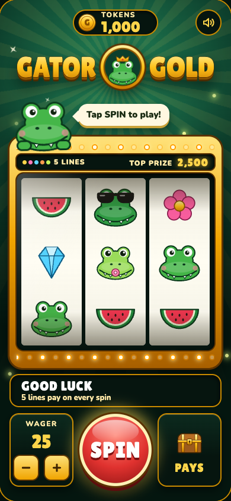
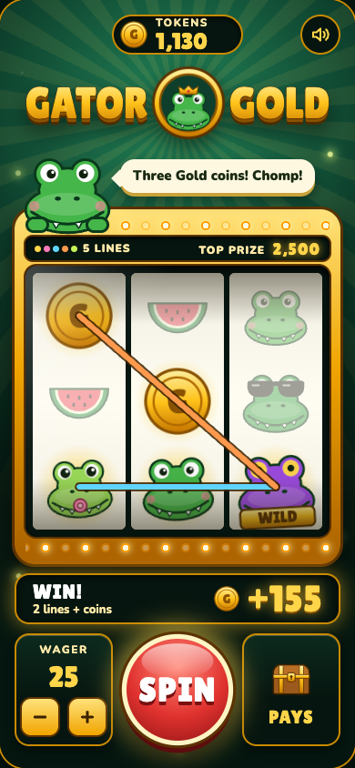
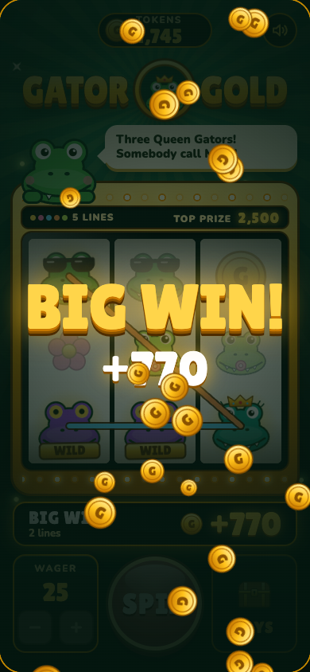
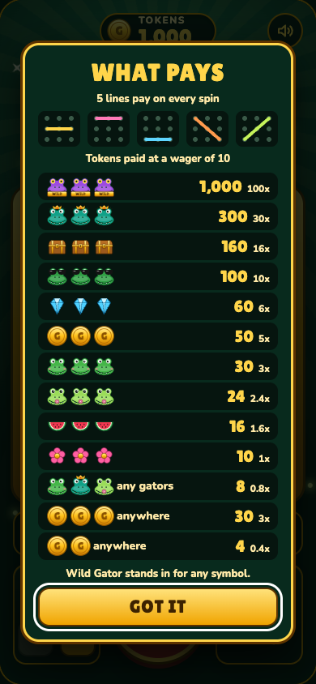
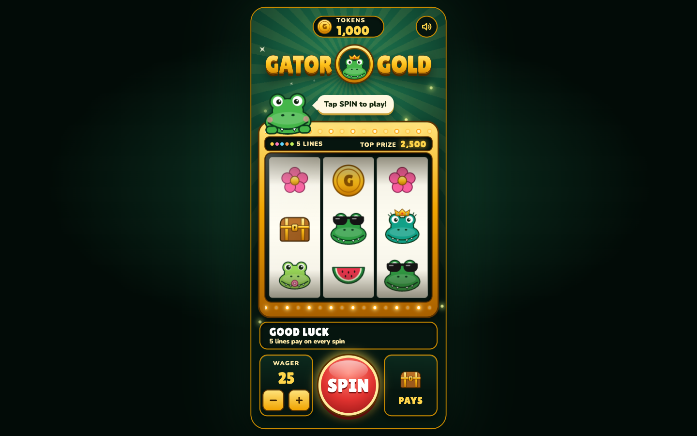

# Feature 5: First look, evidence

Captured on 2026-10-06 against [intent.md](intent.md) by playing the running game in headless Chrome. Reproduce with `npm start` in one terminal and `npm run evidence` in another; raw values are in [evidence/results.json](evidence/results.json).

**Whether it makes you want to play is Mark's call.** The checks below show the pieces are there and nothing broke.

## What changed

- **Logo:** the name in raised gold lettering either side of an emblem, a crowned gator in a gold coin. A light sweeps across the letters and sparkles twinkle around it. The emblem is also the browser tab icon.
- **Motion at rest:** light rays turn slowly behind the logo, fireflies drift, the mascot bobs, the marquee bulbs chase, and the SPIN button pulses with a gold glow.
- **Marquee on the machine:** shows "5 LINES" with the five line colours, and the top prize at the current wager.
- **Mascot invitation:** after about 8 seconds idle, the gator starts cycling through lines inviting a spin.
- **Finish:** glass glare over the reels, a gloss on the SPIN button, depth on the control cards, parts dropping into place when the game opens, and a lit backdrop with a gold rim on a laptop.

## Result against each criterion

| # | Criterion | Result | Evidence |
| --- | --- | --- | --- |
| 1 | Logo always on screen and reads as "Gator Gold" | Pass | Present in every screenshot; labelled "Gator Gold" for screen readers |
| 2 | Browser tab shows the emblem | Pass by check, not seen | The tab icon file is served as an image. A headless browser has no tab to look at |
| 3 | The screen moves before any spin | Pass | 18 animations running at rest |
| 4 | SPIN is the most eye-catching control | Mark's call | It is the largest control, the only red one, and the only one that pulses |
| 5 | Top prize shown and changes with the wager | Pass | 1,000, 2,500, and 5,000 at wagers 10, 25, and 50 |
| 6 | The mascot invites a spin when idle | Pass | "Tap SPIN to play!" became "The gators feel lucky..." after 8.6 s |
| 7 | Fits one phone screen, nothing cut off or overlapping | Pass | Parts stack from 16 to 820 of 844 pixels, all within the side margins. The mascot overlaps the cabinet top by design |
| 8 | Play unchanged, sound still works | Pass | The eight forced spins pay the same as in feature 3; 60 random spins, 0 mismatches; sound checks rerun with no errors |
| 9 | Holds still under reduced motion and stays playable | Pass | 0 animations running at rest; a spin completes and pays 60 |

The page logged no errors. All 30 automated checks pass.

## Screenshots

| | |
| --- | --- |
| At rest, phone  | Several lines winning  |
| Big win  | Payout view  |

Laptop:

## Not covered

- Motion was confirmed by counting running animations, not by watching. Screenshots cannot show the shine, the pulse, or the fireflies.
- Chrome only. Not checked on a real phone or in Safari.
- Slower phones. Eighteen animations at rest were not measured for smoothness or battery use.

## Decisions made while building

- No logo artwork was supplied, so I designed one. If Mark has a logo in mind, it replaces this one.
- The three loose coins from the first mockup were replaced by fireflies, which suit a swamp and move.
- The logo is drawn in the page and relies on the game's font, so there is no standalone logo file apart from the emblem used as the tab icon.
