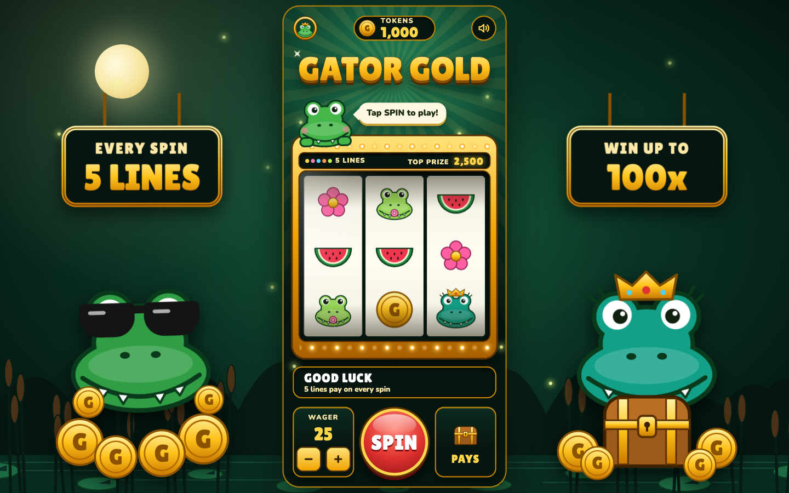
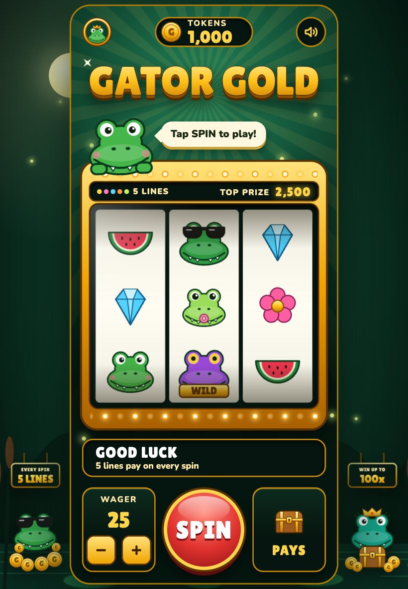
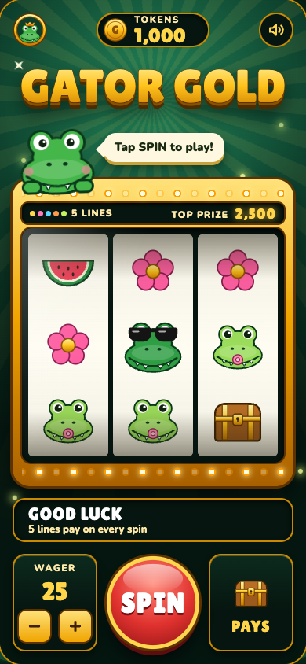
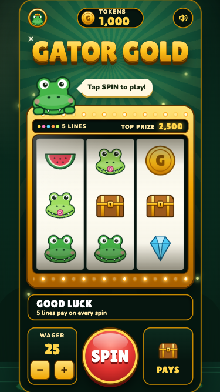

# Feature 6: Fill the screen, evidence

Captured on 2026-10-06 against [intent.md](intent.md) by opening the running game in headless Chrome at six screen sizes. Reproduce with `npm start` in one terminal and `npm run evidence` in another; raw values are in [evidence/results.json](evidence/results.json).

## What changed

- **Logo:** "GATOR GOLD" is now one unbroken line of raised gold lettering. The emblem moved out of the middle of the name to the top-left corner of the machine.
- **Scenery:** a night swamp fills the screen behind the machine: a moon, a treeline, water with lily pads, cattails, and fireflies.
- **Either side of the machine, when there is room:** a hanging gold sign and a large gator. Cool Gator on a pile of coins under "EVERY SPIN, 5 LINES" on the left; Queen Gator with a treasure chest under "WIN UP TO 100x" on the right. The signs sway and the gators bob.
- **Scaling:** the machine is now as large as the screen allows, with no upper limit.

## Screen sizes

| Screen | Size | Machine | Fully on screen | Shape kept | Side scenery | Scenery clear of machine |
| --- | --- | --- | --- | --- | --- | --- |
| Small phone | 375 x 667 | 308 x 667 | Yes | Yes | None, no room | n/a |
| Phone | 390 x 844 | 390 x 844 | Yes | Yes | None, no room | n/a |
| Tall phone | 412 x 915 | 412 x 892 | Yes | Yes | None, no room | n/a |
| Tablet upright | 820 x 1180 | 534 x 1156 | Yes | Yes | Both sides, small | Yes |
| Tablet sideways | 1180 x 820 | 368 x 796 | Yes | Yes | Both sides | Yes |
| Laptop | 1440 x 900 | 405 x 876 | Yes | Yes | Both sides | Yes |

## Result against each criterion

| # | Criterion | Result | Evidence |
| --- | --- | --- | --- |
| 1 | Name reads "GATOR GOLD" in one unbroken line | Pass | One text run, nothing between the letters; see screenshots |
| 2 | Emblem on screen, apart from the name | Pass | Top-left of the machine |
| 3 | Space around the machine is filled on laptop and tablet | Pass | Backdrop at every size; side art on both tablet orientations and the laptop |
| 4 | Machine as large as fits, fully visible, not stretched | Pass | See table. On tablets and laptops it stops 12 pixels short top and bottom so its gold rim shows |
| 5 | Scenery never covers the machine | Pass | Measured at each size |
| 6 | An upright phone is filled as before | Pass | 390 x 844 fills exactly; the small and tall phones fill one dimension |
| 7 | Play, sound, payouts unchanged | Pass | Forced spins pay the same as feature 3; 60 random spins, 0 mismatches; sound checks rerun with no errors; all 30 automated checks pass |
| 8 | Scenery holds still under reduced motion | Pass | 0 animations running on the laptop and the phone |

The page logged no errors.

## Screenshots

Laptop:

Tablet sideways:

| | | |
| --- | --- | --- |
| Tablet upright  | Phone  | Small phone  |

## Not covered

- Real devices. These are emulated screen sizes in Chrome, not a real phone, an iPad, or Safari.
- A phone held sideways. The machine shrinks to fit the short height and is too small to play comfortably. Out of scope for this feature.
- Small phones. At 375 x 667 the machine is 79% size, which makes the wager buttons about 35 pixels across, under the usual 44 for a comfortable tap.
- Very wide monitors. The side art stops growing at 340 pixels wide, so the gaps grow past that.

## Decisions made while building

- I read "separate that out" as taking the emblem out of the middle of the name. With the emblem between the words, the R of GATOR sat tight against it.
- The side signs repeat facts already on the machine (five lines, top prize of 100x). Nothing the player needs lives only in the scenery.
- A small fix came out of testing: the page is now pinned to the window, because on a small phone a few pixels of overflow made the browser zoom the whole game out.
