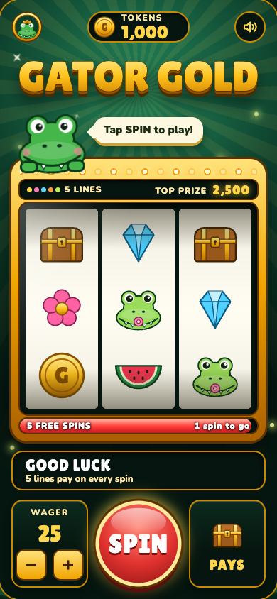
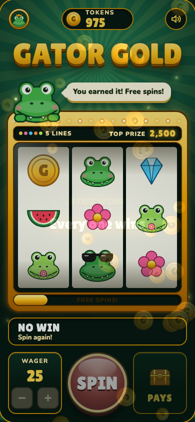
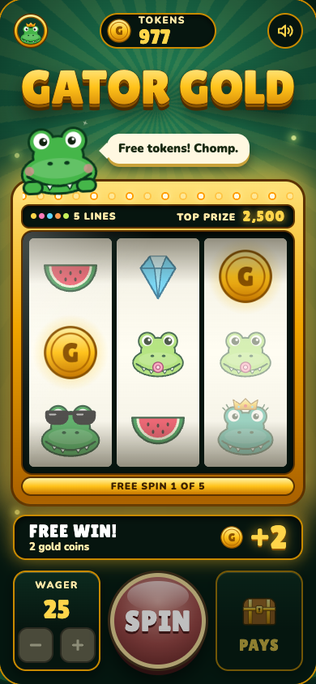
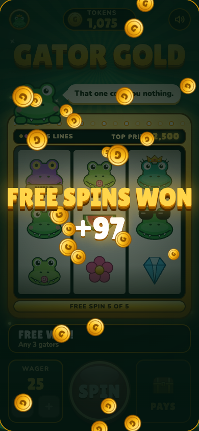
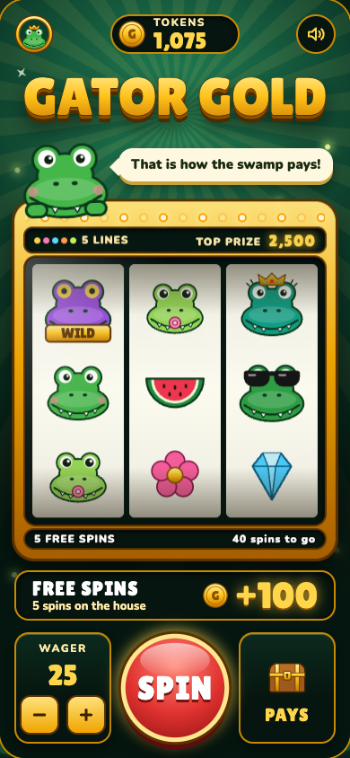
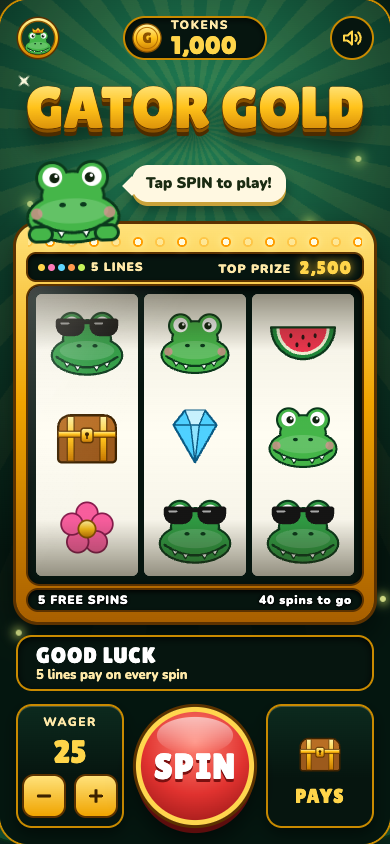
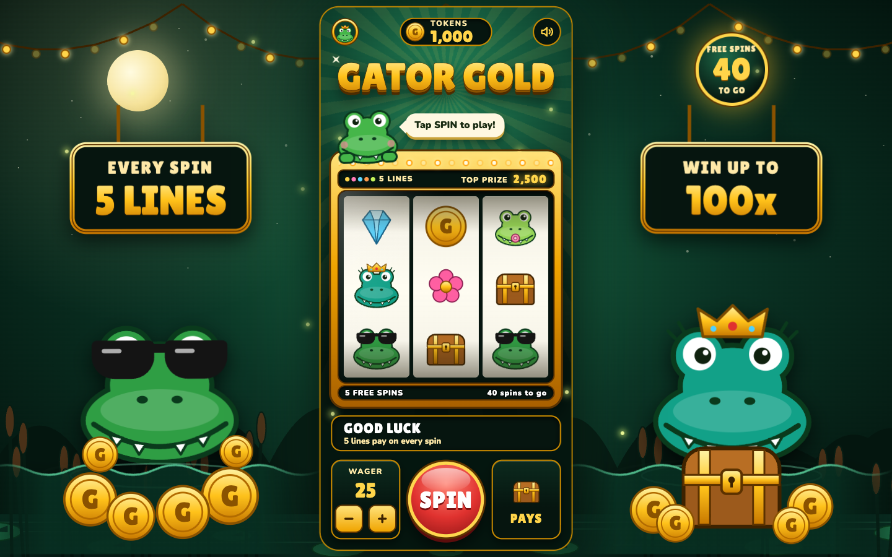

# Feature 7: Free spins, evidence

Captured on 2026-10-06 against [intent.md](intent.md). Reproduce the figures with `npm run report`, the checks with `npm test`, and the browser run with `npm start` plus `npm run evidence`. Raw browser values are in [evidence/results.json](evidence/results.json).

## How the bonus works

- Every paid spin fills the meter along the bottom of the machine by one notch.
- At 40 notches the game awards 5 free spins and plays them itself.
- Free spins cost nothing and every one pays something. Each is a random draw from the winning reel positions only.
- Free spins pay at the wager that filled the meter. Each wager has its own meter, so a meter filled at 10 cannot be cashed in at 50.
- The rule is written in the PAYS view.

## What it cost

Free spins are worth a lot: a bonus pays 7.11 times the wager on average. To keep the game's overall return where it was, the ordinary prizes were trimmed.

| | Before | Now |
| --- | --- | --- |
| Return, everything included | 95.07% | 96.85% |
| Return from paid spins alone | 95.07% | 79.07% |
| Return from free spins | none | 17.77% |
| Any three gators | 0.8x | 0.6x |
| Three Queen Gators | 30x | 25x |
| Three Cool Gators | 10x | 8x |
| Three coins anywhere | 3x | 2x |
| Spins that pay something | 55.61% | 55.61% |

In plain terms: ordinary play is stingier than it was, and about a sixth of everything the game pays now arrives in the bonus.

## Result against each criterion

| # | Criterion | Result | Evidence |
| --- | --- | --- | --- |
| 1 | Meter shows progress on every screen size | Pass | On the machine itself; see phone and laptop screenshots |
| 2 | Each paid spin moves the meter equally | Pass | 40, 39, 38, 37 spins to go over three spins |
| 3 | A full meter awards five free spins, clearly | Pass | Full-screen "5 FREE SPINS! Every one wins" with its own sound |
| 4 | The game plays them; controls are locked | Pass | Free spins 1 to 5 of 5 all seen with no press; SPIN and wager disabled throughout |
| 5 | Free spins are free and always pay | Pass | 20,000 simulated free spins all paid; balance only rises during the bonus |
| 6 | Total shown matches the balance | Pass | Showed +100; balance went 1,000, less the 25 wager, plus 100, to 1,075 |
| 7 | Paid at the filling wager; no cheap fill | Pass | Switching to 50 showed an empty meter; switching back restored 37 to go |
| 8 | Return between 94% and 98% | Pass | 96.85% exact; a 400,000-spin simulated session agrees within 1.5 points |
| 9 | Gators move in water; right side and top filled | Pass by check, Mark's call on looks | Gators drift and dip behind a moving water line with ripples; a free-spins countdown hangs top right; lights and stars run across the top |
| 10 | Fits and scales on the six sizes | Pass | Machine fully on screen and in shape at all six; scenery never covers it |
| 11 | Holds still under reduced motion | Pass | 0 animations running on laptop and phone |

All 40 automated checks pass. The page logged no errors. The 60-spin random play check balanced with no mismatches.

## Screenshots

| | | |
| --- | --- | --- |
| Meter nearly full  | Awarded  | A free spin winning  |
| Bonus total  | Afterwards  | Phone at rest  |

Laptop:

## Not covered

- Nobody has played it. Whether the bonus feels earned, and whether 40 spins is too long to wait, is for Mark and Stephanie to say.
- Whether ordinary play now feels too stingy. The numbers say the overall return is unchanged; the feel may not be.
- The moving gators, water, and lights were confirmed as running animations and seen in stills only.
- Emulated screen sizes in Chrome only. No real phone, tablet, or Safari.
- The bonus sound was measured, not heard.

## Things Mark should know

- **A wager of 50 from 1,000 tokens is now rougher.** It runs out within 100 paid spins in over half of sessions. See the simulated sessions below.
- **Most free spins are small.** The average free spin pays 1.42 times the wager, and the most common one is three mixed gators at 0.6 times. The bonus adds up over five spins rather than landing one big hit.
- **The meter is not saved.** Reloading the page empties it, along with the balance.
- **"The right side doesn't have anything"** was read as the top right of a wide screen, which was bare while the left had the moon. If something else was meant, this needs another look.

## Decisions made while building

- "When the player has earned it" became a visible meter, not a surprise. The player can see exactly how far they are, which is what makes it something to play toward.
- "Let them win" became a stated rule that every free spin pays, not a hidden nudge. The earlier rule that the game never steers a result still holds for paid spins.
- The "5 FREE SPINS" meter replaced the lower row of bulbs on the machine, which is where the height came from.
- On a free spin, a prize smaller than the wager is shown as "FREE WIN!" rather than "SMALL WIN", since the spin cost nothing.

## Exact figures

From all 39,304 reel positions, with 5 lines in play.

| Measure | Value |
| --- | --- |
| Return to player, free spins included | 96.85% |
| Return from paid spins alone | 79.07% |
| Return from free spins | 17.77% |
| Spins that pay anything | 55.61% (one in 1.8) |
| Spins that pay the wager back or more | 18.29% (one in 5.5) |
| Big wins (8x the wager or more) | 1.53% (one in 66) |

## Free spins

| Measure | Value |
| --- | --- |
| Paid spins to fill the meter | 40 |
| Free spins awarded | 5 |
| Chance a free spin pays | 100%, by rule |
| Average free spin pays | 1.42x the wager |
| Average bonus pays | 7.11x the wager |

## Payout table

Prizes as a multiple of the wager.

| Prize | Pays | Symbols per reel |
| --- | --- | --- |
| 3 x Wild Gator on a line | 100x | 1, 1, 1 |
| 3 x Queen Gator on a line | 25x | 2, 2, 2 |
| 3 x Treasure chest on a line | 15x | 2, 2, 2 |
| 3 x Cool Gator on a line | 8x | 3, 3, 3 |
| 3 x Diamond on a line | 6x | 3, 3, 3 |
| 3 x Gold coin on a line | 5x | 3, 3, 3 |
| 3 x Happy Gator on a line | 3x | 4, 4, 4 |
| 3 x Baby Gator on a line | 2x | 5, 5, 5 |
| 3 x Watermelon on a line | 1.2x | 5, 5, 5 |
| 3 x Swamp flower on a line | 0.8x | 6, 6, 6 |
| Any 3 gators on a line | 0.6x | |
| 3 gold coins anywhere | 2x | |
| 2 gold coins anywhere | 0.4x | |

## Where the wins come from

| Kind of prize | Prizes per 100 spins | Share of all tokens returned |
| --- | --- | --- |
| Any 3 gators on a line | 37.5 | 28.4% |
| Gold coins anywhere | 17.3 | 12.5% |
| Three of a kind on a line | 14.5 | 59.1% |

## How big each paid spin pays

| Spin pays | Share of spins | About one in |
| --- | --- | --- |
| Nothing | 44.39% | 2.3 |
| Less than the wager | 37.32% | 2.7 |
| 1x to under 3x | 13.45% | 7.4 |
| 3x to under 10x | 3.31% | 30.2 |
| 8x to under 30x | 1.50% | 66.5 |
| 30x or more | 0.02% | 4367.1 |

The largest possible spin pays 101.8x the wager.

## Simulated sessions

5,000 sessions per row, each starting with 1,000 tokens. Spins are paid spins; free spins are played as they are earned.

| Wager | Spins | Ran out | Ended ahead | Low (10th pct) | Median | High (90th pct) |
| --- | --- | --- | --- | --- | --- | --- |
| 10 | 100 | 0.0% | 31.4% | 652 | 892 | 1220 |
| 10 | 300 | 1.1% | 32.6% | 352 | 808 | 1450 |
| 25 | 100 | 8.0% | 31.1% | 90 | 720 | 1555 |
| 25 | 300 | 48.3% | 29.1% | 5 | 165 | 2065 |
| 50 | 100 | 57.0% | 25.4% | 10 | 40 | 2010 |
| 50 | 300 | 80.0% | 16.4% | 0 | 30 | 2240 |
